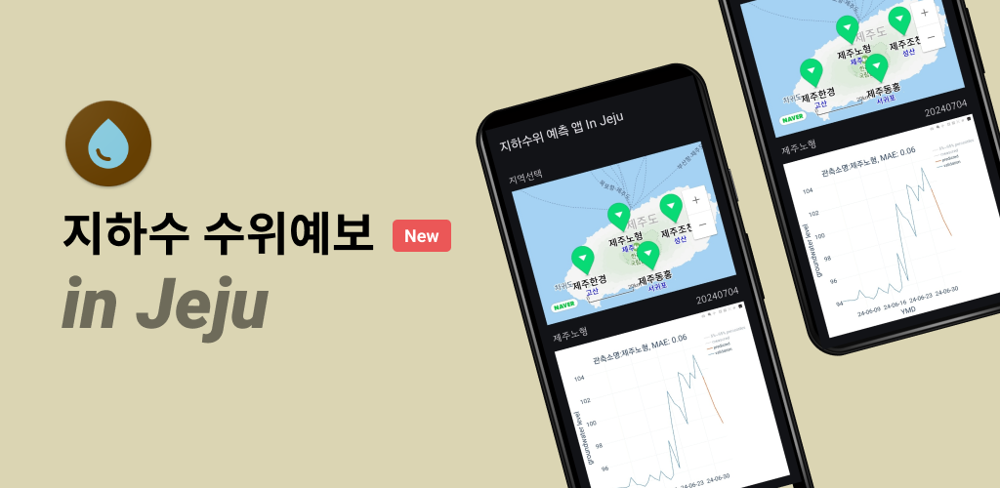
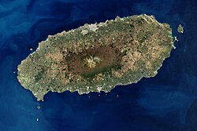

# GW_Pred_App

# 지하수 수위예보 in Jeju

- 일단위 지하수 수위예보를 받아 볼 수 있습니다. (현재 제주지역만 서비스런칭)
- 과거 자료와 비교를 통해 예보 정확도를 눈으로 확인할 수 있습니다.

## 개발일지

### 2024-06-19
- 개발 환경 구축 및 테스트 코드 작성
- 개발 방향성 제시

### 2024-06-24
- Multi Module Architecture 적용
- Hilt, Coroutine, Coil, Retrofit2, OkHttp3 등 라이브러리 적용
- Naver Map API 및 open Source SDK 를 이용한 Naver Map 구현
- 지하 수위 예상 지역 위치 기반 마커 생성

### 2024-07-01
- 이미지 파일 처리를 위한 Naver Cloud Platform - Object Storage 사용
- Object Storage API 연동
- 이미지 저장 및 테스트 진행
  - 이미지 테스트 연결 실패 (E Exception: Unable to resolve host "kr.object.ncloudstorage.com": No address associated with hostname)
    해결 방법 : AndroidMenifest.xml network 설정 및 Mac(개발PC) Network(Wifi DNS 주소 설정 8.8.8.8, 8.8.4.4)
    
### 2024-07-02
- 아이콘 변경 
- 이미지 사이즈 조정
- 공모전 보고서 작성

### 2024-07-04
- AI output 이미지 생성 확인
- model CPU Version code 확인
- model CUDA Version code 확인
- model Mac Version 용 code 구현
  - Mac PC 동작시 에러 발생 : TypeError: Cannot convert a MPS Tensor to float64 dtype as the MPS framework doesn't support float64. Please use float32 instead.
    해결 방법 : MPS(Mac GPU) 사용을 중지하고 CPU 사용으로 전환하여 해결 -> MPS Tensor 를 float32 로 변경 확인 후 진행해 보았으나 동일아 이슈 발생, 몇몇 AI Model에서 Apple Silcon Mac 동작시 해당 이슈가 있는 것을 확인.
    현재 동작 방식이 1일 1회만 동작하면 되므로 실시간성이 필요없다고 판단하여 Mac 에서 Model GPU 가속 옵션을 끄고 진행함.
    
### 2024-07-05
- 앱 v1.0.0 완성
- 구글 플레이스토어 배포 진행
  - 2024-07-09 기준 Google update 검토중

### 2024-07-09
- model 및 App 개발 코드 업로드 (최종)
